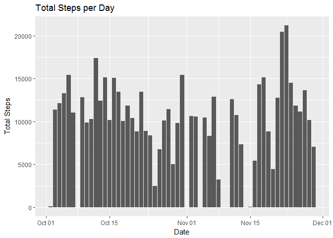
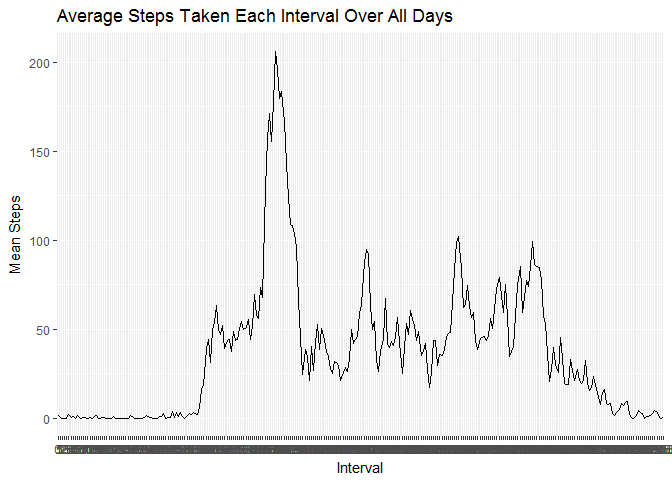
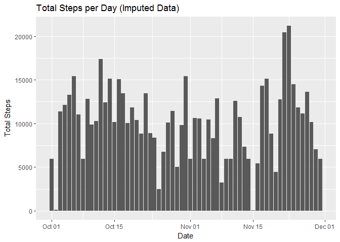
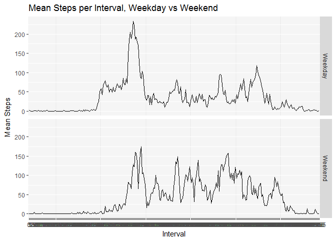

------------------------------------------------------------------------

### Loading Packages Used

The packages used in this document

    library(dplyr)

    ## 
    ## Attaching package: 'dplyr'

    ## The following objects are masked from 'package:stats':
    ## 
    ##     filter, lag

    ## The following objects are masked from 'package:base':
    ## 
    ##     intersect, setdiff, setequal, union

    library(tidyr)
    library(ggplot2)
    library(lubridate)

    ## 
    ## Attaching package: 'lubridate'

    ## The following object is masked from 'package:base':
    ## 
    ##     date

    library(impute)
    library(timeDate)

    ## Warning: package 'timeDate' was built under R version 3.4.3

------------------------------------------------------------------------

### Reading In and Processing Data

The CSV file is read in and the dataframe converted to a table.

    steps <- read.csv("activity.csv") %>% tbl_df()

The classes of the date and interval data are converted to date/time and
factor classes respectively.

    steps$date <- as.Date(steps$date)
    steps$interval <- as.factor(steps$interval)

The data is further processed by removing the rows containing NAs and
two tables are produced that are grouuped by date or interval.

    steps_narm <- filter(steps,!is.na(steps))
    by_day <- group_by(steps_narm, date)
    by_int <- group_by(steps_narm, interval)

------------------------------------------------------------------------

### Histogram of Total Steps Each Day

The total steps made for each day are calculated.

    sumday <- summarise(by_day, sum(steps))

The resulting data is used to create a barchart.

    names(sumday) <- c("date", "total_steps")
    sd <- ggplot(sumday, aes(x=date, y = total_steps))
    sd + geom_bar(stat = "identity") + labs(title = "Total Steps per Day", y = "Total Steps", x = "Date")

------------------------------------------------------------------------

### Mean and Median Steps in a Day

The mean and median steps per day over the data are calculated and shown
respectively.

    names(sumday) <- c("date", "sum")
    mean(sumday$sum)

    ## [1] 10766.19

    median(sumday$sum)

    ## [1] 10765

------------------------------------------------------------------------

### Time Series Plot of Average Number of Steps Taken

The average steps taken per interval over all days are calculated and a
time series gaph created.

    mi <- summarise(by_int, mean = mean(steps))
    mint <- ggplot(mi, aes(x=interval, y = mean, group = 1))
    mint + geom_line() + 
      labs(title = "Average Steps Taken Each Interval Over All Days", y = "Mean Steps", x = "Interval")

------------------------------------------------------------------------

### The 5 min Interval That on Average has the Highest Number of Steps

The interval with the maxium average steps is calculated and shown.

    mi[order(mi$mean, decreasing = T)[1],]

    ## # A tibble: 1 x 2
    ##   interval  mean
    ##   <fct>    <dbl>
    ## 1 835       206.

------------------------------------------------------------------------

### A Strategy for Filling in NAs

The number of missing values is calculated and shown.

    sum(is.na(steps$steps))

    ## [1] 2304

The impute.km() function from the Impute package is used to fill in the
missing values. This method uses nearest neighbours averaging to replace
missing values. In this block of code a matrix with the new data is
created and put it into the imp\_steps table.

    temp_steps <- steps[, c(1,3)] %>% as.matrix()
    imp_matrix <- impute.knn(temp_steps)

    ## Cluster size 17568 broken into 8784 8784 
    ## Cluster size 8784 broken into 4445 4339 
    ## Cluster size 4445 broken into 2250 2195 
    ## Cluster size 2250 broken into 1111 1139 
    ## Done cluster 1111 
    ## Done cluster 1139 
    ## Done cluster 2250 
    ## Cluster size 2195 broken into 862 1333 
    ## Done cluster 862 
    ## Done cluster 1333 
    ## Done cluster 2195 
    ## Done cluster 4445 
    ## Cluster size 4339 broken into 2195 2144 
    ## Cluster size 2195 broken into 980 1215 
    ## Done cluster 980 
    ## Done cluster 1215 
    ## Done cluster 2195 
    ## Cluster size 2144 broken into 2044 100 
    ## Cluster size 2044 broken into 1174 870 
    ## Done cluster 1174 
    ## Done cluster 870 
    ## Done cluster 2044 
    ## Done cluster 100 
    ## Done cluster 2144 
    ## Done cluster 4339 
    ## Done cluster 8784 
    ## Cluster size 8784 broken into 4401 4383 
    ## Cluster size 4401 broken into 2275 2126 
    ## Cluster size 2275 broken into 2007 268 
    ## Cluster size 2007 broken into 845 1162 
    ## Done cluster 845 
    ## Done cluster 1162 
    ## Done cluster 2007 
    ## Done cluster 268 
    ## Done cluster 2275 
    ## Cluster size 2126 broken into 928 1198 
    ## Done cluster 928 
    ## Done cluster 1198 
    ## Done cluster 2126 
    ## Done cluster 4401 
    ## Cluster size 4383 broken into 2187 2196 
    ## Cluster size 2187 broken into 976 1211 
    ## Done cluster 976 
    ## Done cluster 1211 
    ## Done cluster 2187 
    ## Cluster size 2196 broken into 1220 976 
    ## Done cluster 1220 
    ## Done cluster 976 
    ## Done cluster 2196 
    ## Done cluster 4383 
    ## Done cluster 8784

    imp_steps <- steps
    imp_steps$steps <- imp_matrix$data

------------------------------------------------------------------------

### Histogram of Total Steps Each Day After NAs Filled

The total steps taken each day is calculated with the imputed dataset
and then used to create a barchart showing the results.

    sum_imp <- imp_steps %>% group_by(date) %>% summarise(sum(steps))
    names(sum_imp) <- c("date", "total_steps")
    sum_imp$total_steps <- as.integer(sum_imp$total_steps)
    si <- ggplot(sum_imp, aes(x=date, y = total_steps))
    si + geom_bar(stat = "identity") + labs(title = "Total Steps per Day (Imputed Data)", y = "Total Steps", x = "Date")

------------------------------------------------------------------------

### Panel Plot Comparing the Average Number of Steps per Interval Across Weekdays and Weekends

To seperate the data into weekend and weekday data a column is added to
the steps\_narm table (original data minus missing values) showing when
the data was collected. The weekday and weekend rows are then subsetted
into two tables. The average steps for each interval are calculated for
each table. The tables are then bound together and used to create a
panel plot showing the average steps per interval across weekends and
weekdays.

    steps_narm$weekday <- isWeekday(steps_narm$date)
    steps_wkd <- filter(steps_narm, weekday == TRUE)
    steps_wke <- filter(steps_narm, weekday == FALSE)

    m_wd <- steps_wkd %>%group_by(interval) %>% summarise(mean(steps))
    m_wd$weekday <- "Weekday"

    m_we <- steps_wke %>%group_by(interval) %>% summarise(mean(steps))
    m_we$weekday <- "Weekend"

    m_wde <- bind_rows(m_wd, m_we)
    names(m_wde) <- c("interval", "mean_steps", "weekday")
    m_wde$weekday <- as.factor(m_wde$weekday)

    sw <- ggplot(m_wde, aes(x=interval, y = mean_steps, group = 1))
    sw + 
      geom_line() + 
      labs(title = "Mean Steps per Interval, Weekday vs Weekend", y = "Mean Steps", x ="Interval") + 
      facet_grid(weekday~.)

The plot shows a difference in activity patterns between the week and
weekend. During the week there is a spike of activty in the morning
while during the weekend the ammount od steps taken is more consistant
over the day.
